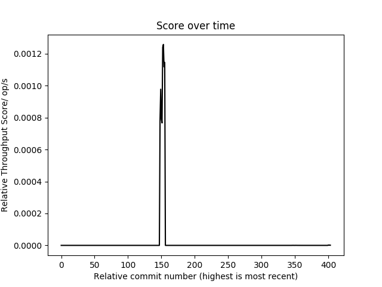
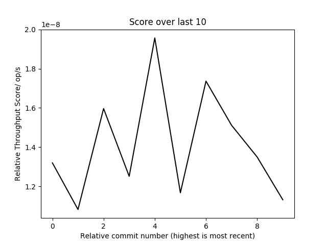

# Documentation

## What I've done:
* Set up a maven project in java, store on GitHub
* Wrote some new iterators for the summation, addition and tensor Dot Product of datasets/tensors, before and after they have been transposed.  Used junit testing to test my code.
* Wrote benchmarks for my iterators and the original iterators in Eclipse January
* Set up Travis CI so that it builds my project, runs the junit tests and if passses those will then run the benchmarking
* Wrote some python scripts that are called after success in Travis  - store data and plot graphs, Travis then pushes back to GitHub

## Maven Project
### Build automation tool, normally for Java projects
* POM(Project Object Model): provides the configuration for the project
* Using the maven shade plugin in the POM (need to put in)
* Can change the <mainClass> tag so outputs the runnable class you want
* Dependencies used:
  1. Junit: 4.12
  2. Jmh-core: 1.19
  3. Jmh-generator-annprocess: 1.19
  4. Org.eclipse.january: 2.0.2
* *I remember having to delete something in the POM, as otherwise got lots of error messages in eclipse. I can’t remember what it was but if having this problem, compare with my POM on GitHub.*
* When run maven build, automatically runs the junit testing 

## GitHub
* Github deletes empty directories
* GitHub pages : Can have a repo for this (e.g. Esmae.github.io), can also have a page for each repo, with either the master or gh-pages branch set as the publishing source

<!DOCTYPE html>
<html>
<body>

    
</body>
</html> 
